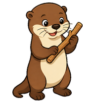
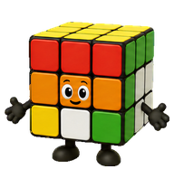
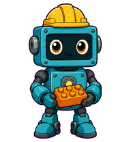
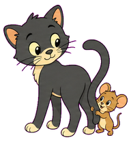
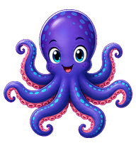

# ChatGPT Pets

[Deutsche Version](README.md)

A collection of custom, importable pets for ChatGPT and Codex.

## Pets

| [**Woodi**](Woodi/README.en.md) | [**WonderCube**](WonderCube/README.en.md) | [**Delta**](Delta/README.en.md) | [**Byte**](Byte/README.en.md) | [**Whiskers & Squeak**](MischiefDuo/README.en.md) | [**Inky**](Inky/README.en.md) |
| --- | --- | --- | --- | --- | --- |
|  |  |  |  |  |  |
| An otter with a small wooden stick. | A puzzle cube that solves itself while working. | A friendly badge that waves and works at a control panel. | A robot carefully assembling a small tower. | A retro slapstick cat-and-mouse pair. | An octopus that plays with its arms and changes color. |

## Import a pet

1. Open the folder of the pet you want.
2. Download its sprite-sheet file.
3. Open ChatGPT or Codex and go to Pet management. You can also do this in the ChatGPT app, for example on iPhone or iPad.
4. Choose **Import**, select the downloaded file, and activate the pet.
