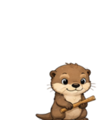

# ChatGPT Pets

[Deutsche Version](README.md)

A collection of custom, importable pets for ChatGPT and Codex.

## Pets

| Pet | Description |
| --- | --- |
|  | [**Otti – the hardworking otter**](Otti) · A friendly otter happily gnawing on a small wooden stick. |
|  | [**Delta – the playful insignia**](Delta) · A Star Trek delta insignia that waves, flies, works, and makes small jokes. |
|  | [**Cube – the puzzle cube**](Cube) · A puzzle cube that is visibly solved step by step while working. |
|  | [**Byte – the construction robot**](Byte) · A small robot that carefully assembles building blocks while working. |

## Import a pet

1. Open the folder of the pet you want.
2. Download its sprite-sheet file.
3. Open ChatGPT or Codex on your Mac and open pet management.
4. Choose **Import**, select the downloaded file, and activate the pet.
